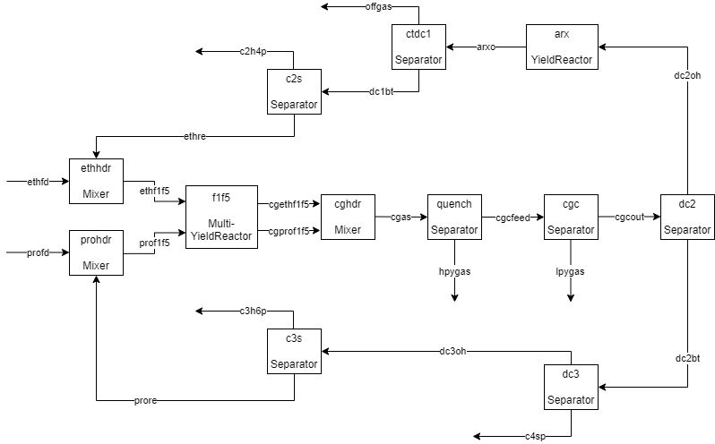

## Mixer, StoicReactor, Separator
This is an example of a simple flowsheet with a `Mixer`, `StoicReactor`, and `Separator`.

```@setup EX1
using Pkg; Pkg.activate("..", io=devnull); push!(LOAD_PATH, "../../src");
```
Add the package from the Julia REPL in the usual way; type `]` to enter the Pkg REPL mode and run
```
pkg> add MassBalanceOpt
```
To do anything useful you'll also need three other packages:
```
pkg> add JuMP Ipopt OrderedCollections
```
Then import the packages:
```@example EX1
using MassBalanceOpt, JuMP, Ipopt, OrderedCollections
```
Create a JuMP model and a `Flowsheet` to hold the blocks and streams:
```@example EX1
m = Model(Ipopt.Optimizer); fs = Flowsheet();
```
Suppose we have a feed stream of pure component `A` that mixes with a recycle stream and is fed to a reactor, where the reaction `A => B + C` takes place with a specified conversion of component `A`. The reactor effluent is fed to a distillation column where component `C` and most of `B` goes overhead, with unreacted `A` and a small amount of `B` going out the bottom and back to the feed header. To create the streams we need to first make some component groups:
```@example EX1
c_A   = @components A
c_AB  = @components A B
c_BC  = @components B C
c_all = @components A B C
```
Now we can create the feed, recycle, and reactor inlet streams:
```@example EX1
(feed, recycle, rx_in) = @streams begin
    feed   , c_A
    recycle, c_AB
    rx_in  , c_AB
end
```
The feed and recycle streams flow into a `Mixer` block named `feedhdr`:
```@example EX1
feedhdr = @block(feedhdr, Mixer, [feed, recycle], rx_in)
```
Here's what the model looks like so far:
```@example EX1
print_model(m)
```
The two inlet streams to `feedhdr` have fixed flow rates and compositions that are set to default values when the block was created. The `recycle` stream flow rate and composition will eventually become free variables after the rest of the model is built, but right now we need to provide values for the fixed variables:
```@example EX1
@values begin
    feedhdr_feed_mass          = 10_000.0
    feedhdr_recycle_mass       = 2_000.0
    feedhdr_recycle_A_massfrac = 0.99
    feedhdr_recycle_B_massfrac = 0.01
end
print_fixed(m)
```
Now we can estimate start values for the free variables in block `feedhdr`:
```@example EX1
set_start_values(feedhdr)
print_vars(m)
```
Now we can create the reactor outlet stream and the reactor block:
```@example EX1
rx_out = @stream(rx_out, c_all)
rx_stoic = @stoic A => B + C    # Reaction stoichiometry
mw = Dict(:A => 30.0, :B => 15.0, :C => 10.0)    # Molecular weights
conv = OrderedDict(1 => (c=:A, X=0.8))    # Conversion in reaction 1 (A => B + C)
rx = @block(rx, StoicReactor, rx_in, rx_out, rx_stoic, mw, conv)
print_vars(rx)
```
Notice that the reactor inlet stream mass flow rate and composition are fixed to default values. We need to `connect` the stream `rx_in` so that the mass flow rate and composition of stream `rx_in` in block `rx` are equal to the mass flow rate and composition of `rx_in` in block `feedhdr`. Then we can estimate the start values and solve the model:
```@example EX1
connect(rx_in)
set_start_values(rx)
@solve
print_vars(m)
```
The solver converged immediately because the start value estimates were equal to the values at the solution. This won't always be the case. Now we can create the block that models the distillation column:
```@example EX1
product = @stream(product, c_BC)
col = @block(col, Separator, rx_out, [product, recycle])
print_fixed(col)
```
We connect the stream `rx_out` and set the value of the split fraction of component `B` into the `recycle` stream. We don't need to specify split fractions for `A` or `C` because the component set specifications force all `A` into the `recycle` stream and all `C` into the `product` stream.
```@example EX1
connect(rx_out)
@set col_B_recycle_split = 0.01
set_start_values(col)
@solve
print_vars(col)
```
We don't really want to fix `col_B_recycle_split` though. A controller will be controlling the mass fraction of `B` in the `recycle` stream to a setpoint, so we want to fix the `B` mass fraction in the `recycle` stream and free `col_B_recycle_split`. This is called "flipping" the specs on the two variables, and is done like this:
```@example EX1
@specs col_B_recycle_split ~ col_recycle_B_massfrac
@set col_recycle_B_massfrac = 0.01    # Set the mass fraction of B in the recycle stream
@solve
print_vars(col)
```
Finally we can connect the `recycle` stream and solve the complete problem:
```@example EX1
connect(recycle)
@solve
print_vars(m)
```

## Simple Ethylene Plant

This is an example of the use of the MassBalanceOpt package to build a simple model of an ethylene plant and solve it with `JuMP`. Here is a block diagram of the flowsheet:




```@setup EX2
using Pkg; Pkg.activate("..", io=devnull); push!(LOAD_PATH, "../../src");
using MassBalanceOpt, JuMP, Ipopt, OrderedCollections
```

Create a `JuMP` model that uses the `Ipopt` solver:


```@example EX2
m = Model(Ipopt.Optimizer)
```

Create a `Flowsheet` to contain the variables and equations of the model. The default name of a flowsheet is `:index`. The `:index` flowsheet does not have a parent flowsheet.


```@example EX2
fs = Flowsheet()
```

The plant will have two feed streams: ethane and propane, each containing only one component. A component is simply a `Symbol`; it doesn't have any attributes like a chemical formula or molecular weight.


```@example EX2
comps_eth_feed = @components c2h6
comps_pro_feed = @components c3h8
```

The feed streams are mixed with ethane and propane recycle streams. The component sets for the recycle streams are:


```@example EX2
comps_eth_rec = @components c2h4 c2h6
comps_pro_rec = @components c3h6 c3h8 mapd
```

The fresh feed streams are mixed with their recycle streams in `Mixer` blocks. These blocks need streams for the fresh feeds, recycles, and the mixed feed/recycle:


```@example EX2
(ethfd, ethre, ethf1f5, profd, prore, prof1f5) = @streams begin
        ethfd   , comps_eth_feed   # Ethane fresh feed
        ethre   , comps_eth_rec    # Ethane recycle
        ethf1f5 , comps_eth_rec    # Mixed fresh ethane feed and ethane recycle to furnaces F-1 through F-5.
        profd   , comps_pro_feed   # Propane fresh feed
        prore   , comps_pro_rec    # Propane recycle
        prof1f5 , comps_pro_rec    # Mixed fresh propane feed and propane recycle to furnaces F-1 through F-5.
    end
```

Create `Mixer` blocks that represent the ethane and propane feed headers:


```@example EX2
ethhdr = @block(ethhdr, Mixer, [ethfd, ethre], ethf1f5)
prohdr = @block(prohdr, Mixer, [profd, prore], prof1f5)
```

Print the equations and variables in the model so far:


```@example EX2
print_model(m)
```

Note that the feed stream flow rates and compositions are fixed at default values. The recycle stream flow rates and compositions are also fixed for now; that will be changed after the rest of the model has been built. Set the values of the fixed variables to more realistic values:


```@example EX2
@values begin
    ethhdr_ethfd_mass = 80_000.0
    prohdr_profd_mass = 34_000.0
    ethhdr_ethre_mass = 39_000.0
    prohdr_prore_mass = 5_000.0
    
    ethhdr_ethre_c2h4_massfrac = 0.005
    ethhdr_ethre_c2h6_massfrac = 0.995
    prohdr_prore_c3h6_massfrac = 0.005
    prohdr_prore_c3h8_massfrac = 0.96
    prohdr_prore_mapd_massfrac = 0.035
end
```

The function `set_start_values` will calculate initial guesses for the free variables:


```@example EX2
set_start_values([ethhdr, prohdr])
print_vars(m)
```

Solve the model:


```@example EX2
@solve
```

The solver converged immediately because `set_start_values` is able to calculate the values of the free variables exactly, in this case.

The mixed feed and recycle streams are fed to the cracking furnaces, which are reactors that thermally crack the feeds into a mixture called "cracked gas." In this simple model the cracked gas will consist of the following components:


```@example EX2
comps_cg = @components h2 ch4 c2h2 c2h4 c2h6 c3h6 c3h8 mapd c4s pygas
```

The ethane and propane feeds are cracked in separate furnaces. The purpose of the model is to calculate the optimal flow rates of ethane and propane feed, given constraints on furnace capacity. The cracked gas streams leaving the ethane and propane furnaces are:


```@example EX2
(cgethf1f5, cgprof1f5) = @streams begin
    cgethf1f5 , comps_cg, (basis=FLOW)
    cgprof1f5 , comps_cg, (basis=FLOW)
end
```

The cracked gas streams a `FLOW` basis because their mass flow rates may be zero at the solution, which would make the equations based on a mass fraction formulation become singular. The furnaces are modeled with a `MultiYieldReactor` with two feeds: `:eth` and `:pro`.


```@example EX2
f1f5 = @block(f1f5, MultiYieldReactor, [ethf1f5, prof1f5], [cgethf1f5, cgprof1f5], [:eth, :pro], :furn)
```

The values of the fixed variables in the furnace model are:


```@example EX2
print_fixed(f1f5)
```

The values of the fixed inlet stream variables will become free after the streams are connected (see below). The rest of the fixed variables are inputs to the model that need to be set. The single-pass yields in the furnaces are:


```@example EX2
@values begin
    f1f5_eth_y_h2_from_c2h6    = 0.0411
    f1f5_eth_y_ch4_from_c2h6   = 0.05
    f1f5_eth_y_c2h2_from_c2h6  = 0.003
    f1f5_eth_y_c2h4_from_c2h6  = 0.495
    f1f5_eth_y_c3h6_from_c2h6  = 0.0043
    f1f5_eth_y_c3h8_from_c2h6  = 0.01
    f1f5_eth_y_mapd_from_c2h6  = 0.0002
    f1f5_eth_y_c4s_from_c2h6   = 0.03
    f1f5_eth_y_pygas_from_c2h6 = 0.02
    
    f1f5_eth_y_h2_from_c2h4    = -0.009
    f1f5_eth_y_ch4_from_c2h4   = 0.129
    f1f5_eth_y_c2h2_from_c2h4  = 0.004
    f1f5_eth_y_c2h6_from_c2h4  = 0.0
    f1f5_eth_y_c3h6_from_c2h4  = 0.003
    f1f5_eth_y_c3h8_from_c2h4  = 0.002
    f1f5_eth_y_mapd_from_c2h4  = 0.0
    f1f5_eth_y_c4s_from_c2h4   = 0.05
    f1f5_eth_y_pygas_from_c2h4 = 0.15
    
    f1f5_pro_y_h2_from_c3h8    = 0.01
    f1f5_pro_y_ch4_from_c3h8   = 0.21
    f1f5_pro_y_c2h2_from_c3h8  = 0.004
    f1f5_pro_y_c2h4_from_c3h8  = 0.35
    f1f5_pro_y_c2h6_from_c3h8  = 0.04
    f1f5_pro_y_c3h6_from_c3h8  = 0.16
    f1f5_pro_y_mapd_from_c3h8  = 0.004
    f1f5_pro_y_c4s_from_c3h8   = 0.015
    f1f5_pro_y_pygas_from_c3h8 = 0.025
    
    f1f5_pro_y_h2_from_c3h6    = -0.0035
    f1f5_pro_y_ch4_from_c3h6   = 0.15 
    f1f5_pro_y_c2h2_from_c3h6  = 0.005 
    f1f5_pro_y_c2h4_from_c3h6  = 0.04 
    f1f5_pro_y_c2h6_from_c3h6  = 0.004 
    f1f5_pro_y_c3h8_from_c3h6  = 0.0000
    f1f5_pro_y_mapd_from_c3h6  = 0.002
    f1f5_pro_y_c4s_from_c3h6   = 0.03
    f1f5_pro_y_pygas_from_c3h6 = 0.15

    f1f5_pro_y_c3h6_from_mapd  = 1.0
end
```

The flow rates of ethane and propane feed per furnace are:


```@example EX2
@values begin
    f1f5_eth_rate = 30_000.0
    f1f5_pro_rate = 40_000.0
end
```

Now that most of the fixed variables have been set, the `ethf1f5` and `prof1f5` inlet streams can be connected, which will free the inlet stream variables in the `f1f5` block and copy the start values from the upstream `Mixer` blocks into the `f1f5` block. The `set_start_values` function can then calculate the rest of the start values:


```@example EX2
connect([ethf1f5, prof1f5])
set_start_values(f1f5)
@solve
```

The cracked gas streams leaving the furnaces are mixed together in the cracked gas header. The same pattern is used to add additional blocks to the model:

1. Define component groups
2. Create inlet and outlet streams
3. Create the block
4. Connect the block's inlet streams to the upstream block
5. Configure variable specifications if necessary
6. Set values of the fixed variables
7. Call `set_start_values`
8. Solve the model and print variables if desired

To keep the output as concise as possible we'll avoid solving the model repeatedly in this example. In practice, a solve is usually done after adding each new block. 


```@example EX2
# Cracked gas header.
cgas = @stream(cgas, comps_cg)
cghdr = @block(cghdr, Mixer, [cgethf1f5, cgprof1f5], cgas)
connect([cgethf1f5, cgprof1f5])
set_start_values(cghdr)
```

The cracked gas flows to the quench section, where heavy pygas is separated out as a product. In this simple model, there's only one `pygas` component, so we'll pretend that 30% of it is heavy pygas. The outlet stream from the quench section flows to the cracked gas compressor section, where the rest of the pygas is removed.


```@example EX2
# Quench section.
comps_pg = @components pygas
(hpygas, cgcfeed) = @streams begin
    hpygas  , comps_pg
    cgcfeed , comps_cg
end
quench = @block(quench, Separator, cgas, [hpygas, cgcfeed])
@set quench_pygas_hpygas_split = 0.3
connect(cgas)

# Cracked gas compressor section.
comps_pygas  = @components  pygas
comps_DC2    = @components  h2 ch4 c2h2 c2h4 c2h6 c3h6 c3h8 mapd c4s
(lpygas, cgcout) = @streams begin
    lpygas , comps_pygas
    cgcout , comps_DC2
end
cgc = @block(cgc, Separator, cgcfeed, [lpygas, cgcout])
connect(cgcfeed)
set_start_values([quench, cgc])
```

The cracked gas compressor section outlet stream flows to the front-end deethanizer, which splits it into C2- overhead and C3+ bottoms streams.


```@example EX2
# Front-end deethanizer.
comps_DC2oh = @components  h2 ch4 c2h2 c2h4 c2h6
comps_DC2bt = @components  c3h6 c3h8 mapd c4s
(dc2oh, dc2bt) = @streams begin
    dc2oh , comps_DC2oh
    dc2bt , comps_DC2bt
end
dc2 = @block(dc2, Separator, cgcout, [dc2oh, dc2bt])
connect(cgcout)
set_start_values(dc2)
```

The overhead stream from the deethanizer flows to the acetylene reactors, which convert all of the acetylene into ethylene and ethane.


```@example EX2
# Acetylene reactors.
comps_ARX = @components  h2 ch4 c2h4 c2h6
arxo = @stream(arxo, comps_ARX)
arx_stoic = @stoic begin    # Reaction stoichiometry
    c2h2 + h2  => c2h4
    c2h2 + 2h2 => c2h6
end

arx_mw = Dict(:c2h2 => 26.03728,    # Molecular weights of the reacting components
              :h2   =>  2.01588,
              :c2h4 => 28.05316,
              :c2h6 => 30.06904)

arx_conv = OrderedDict(1 => (c=:c2h2, X=0.7))   # C2H2 conversion in reaction 1.
                                                # Don't need to specify C2H2 conversion in reaction 2, because
                                                # C2H2 is not present in the outlet stream component list.
                                                
arx = @block(arx, StoicReactor, dc2oh, arxo, arx_stoic, arx_mw, arx_conv)
connect(dc2oh)
set_start_values(arx)
```

The acetylene reactor outlet stream flows to the cold train/demethanizer. The offgas, containing H2, CH4, and a small amount of C2H4, is separated out as a product.


```@example EX2
# Cold train/demethanizer.
comps_OG  = @components  h2 ch4 c2h4
comps_C2S = @components  c2h4 c2h6
(offgas, dc1bt) = @streams begin
    offgas , comps_OG
    dc1bt  , comps_C2S
end
ctdc1 = @block(ctdc1, Separator, arxo, [offgas, dc1bt])
connect(arxo)

# The split fraction of C2H4 in the offgas starts out as a fixed variable. The offgas C2H4 mass fraction is free.
# To calculate good start values, we have to set the value of the split fraction.
@set ctdc1_c2h4_offgas_split = 0.001
set_start_values(ctdc1)

# Now we flip the specs, which frees the offgas C2H4 split fraction and fixes the offgas C2H4 mass fraction.
# We need to set the offgas C2H4 mass fraction to the desired value.
@specs(ctdc1_c2h4_offgas_split ~ ctdc1_offgas_c2h4_massfrac)
@set ctdc1_offgas_c2h4_massfrac = 0.005

```

The demethanizer bottoms stream flows to the C2 splitter, which splits it into an ethylene product stream and a recycle stream to the ethane header. The recycle stream is mostly ethane with a small amount of ethylene mixed in.


```@example EX2
# C2 splitter.
c2h4p = @stream(c2h4p, comps_C2S)
c2s = @block(c2s, Separator, dc1bt, [c2h4p, ethre])

# Since c2s_c2h4_c2h4p_split is the first split frac, it's fixed by default. But we prefer to fix
# c2s_c2h4_ethre_split instead, so flip the specs on those two variables.
@specs c2s_c2h4_c2h4p_split ~ c2s_c2h4_ethre_split

# Assign values to the fixed split fracs and set the start values.
@values begin
    c2s_c2h6_c2h4p_split    = 0.001
    c2s_c2h4_ethre_split    = 0.003
end
connect([dc1bt, ethre])
set_start_values(c2s)

# Flip the specs to fix the mass fractions and free the split fracs.
@specs begin
    c2s_c2h4_ethre_split    ~ c2s_ethre_c2h4_massfrac
    c2s_c2h4p_c2h6_massfrac ~ c2s_c2h6_c2h4p_split
end

# Set the values of the fixed mass fractions.
@values begin
    c2s_c2h4p_c2h6_massfrac = 0.0008
    c2s_ethre_c2h4_massfrac = 0.005
end
```

The deethanizer bottoms flows to the depropanizer, which splits it into C3- overhead and C4 bottoms streams.


```@example EX2
# Depropanizer.
comps_DC3oh   = @components  c3h6 c3h8 mapd
comps_DC3bt   = @components  c4s
(dc3oh, c4sp) = @streams begin
    dc3oh  , comps_DC3oh
    c4sp   , comps_DC3bt
end

# The separation is assumed to be clean, so all the split fracs are 1.
dc3 = @block(dc3, Separator, dc2bt, [dc3oh, c4sp])
connect(dc2bt)
set_start_values(dc3)
```

The depropanizer overhead C3- stream is fed to the C3 splitter, which produces a propylene product stream and a propane recycle stream.


```@example EX2
# C3 splitter.
comps_C3Soh   = @components  c3h6 c3h8
c3h6p = @stream(c3h6p, comps_C3Soh)
c3s = @block(c3s, Separator, dc3oh, [c3h6p, prore])
connect(dc3oh)

# Fix c3s_c3h8_c3h6p_split and free c3s_c3h8_prore_split, and set the fixed split fractions.
@specs c3s_c3h8_c3h6p_split ~ c3s_c3h8_prore_split
@values begin
    c3s_c3h6_prore_split = 0.003
    c3s_c3h8_c3h6p_split = 0.00017
end

# Calculate the start values.
set_start_values(c3s)

# Flip the split fracs with the mass fractions, and set the mass fractions.
@specs begin
    c3s_prore_c3h6_massfrac ~ c3s_c3h6_prore_split
    c3s_c3h6p_c3h8_massfrac ~ c3s_c3h8_c3h6p_split
end
@set c3s_c3h6p_c3h8_massfrac = 0.0001
@set c3s_prore_c3h6_massfrac = 0.005

# Connect the propane recycle, and solve the model.
connect(prore)
@solve
```

Update all the start values in the model.


```@example EX2
set_start_values(m)
```

Define a set of prices and an objective function:


```@example EX2
# Prices and objective function.
prices = Dict(
    :ethane_feed  => 10.0,
    :propane_feed => 15.0,
    :c2h4_prod    => 40.0,
    :c3h6_prod    => 30.0,
    :c4s_prod     => 28.0,
    :pygas_prod   => 23.0,
    :offgas_prod  => 25.0
    )
map!(p -> p/100.0, values(prices))  # Convert from cents/lb to #/lb

costs = @expression(m, m[:ethhdr_ethfd_mass]  * prices[:ethane_feed] +
                       m[:prohdr_profd_mass]  * prices[:propane_feed])
sales = @expression(m, m[:c2s_c2h4p_mass]     * prices[:c2h4_prod] +
                       m[:c3s_c3h6p_mass]     * prices[:c3h6_prod] +
                       m[:dc3_c4sp_mass]      * prices[:c4s_prod]  +
                       m[:quench_hpygas_mass] * prices[:pygas_prod] +
                       m[:cgc_lpygas_mass]    * prices[:pygas_prod] +
                       m[:ctdc1_offgas_mass]  * prices[:offgas_prod])
@objective(m, Max, sales - costs);
```

Make the ethane and propane feed flow rates degrees of freedom.


```@example EX2
@specs begin
    -ethhdr_ethfd_mass
    -prohdr_profd_mass
end
dof = [m[:ethhdr_ethfd_mass], m[:prohdr_profd_mass]]
```

Add some variable bounds.


```@example EX2
@bounds begin
    0.0 < ethhdr_ethfd_mass < 2.0e5
    0.0 < prohdr_profd_mass < 2.0e5
    f1f5_n_furn < 5.0
    0.0 < f1f5_pro_n_furn < 3.0
    1.0 < f1f5_eth_n_furn
end
print_bounds(m)
```

Solve the optimization problem.


```@example EX2
@solve
```

Print the values of the degrees of freedom at the solution, the active bounds, and the value of the objective function.


```@example EX2
print_vars(dof)
print_active(m)
eval_obj(m)
```

Update the start values.


```@example EX2
set_start_values(m)
```

Lower the ethane feed price to half its previous value and solve the problem again.


```@example EX2
set_objective_coefficient(m, m[:ethhdr_ethfd_mass], 5.0/100.0)
@solve
```

The solver decreases the fresh propane feed flow rate to zero. 


```@example EX2
print_vars(dof)
print_active(m)
eval_obj(m)
```
